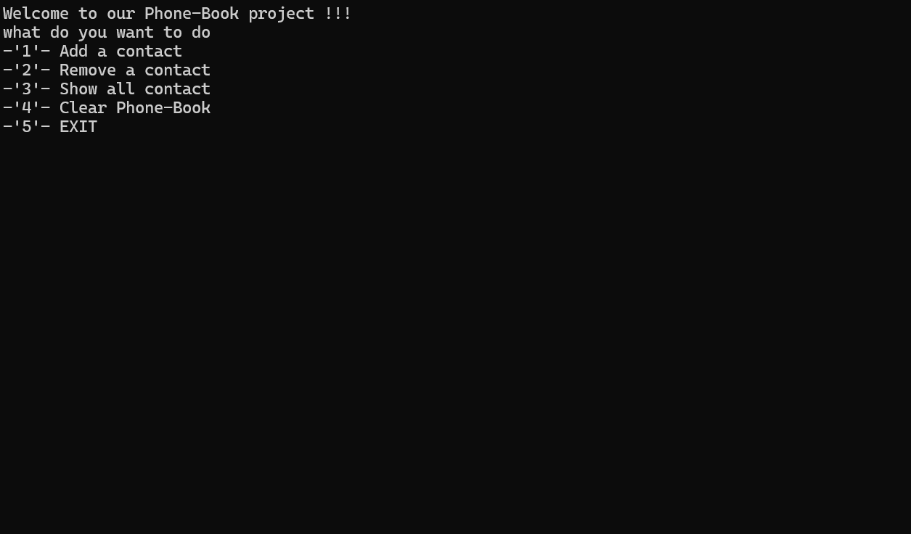

> # PhoneBookWithFile

## This project creates a simple and convenient interface for managing the phone book. Users can add, delete, view and clear the file of their contacts.

---------------------------------------------------------------------------

### Project structure.

#### The project consists of three main parts:

1. Program.cs The main application part interacts with the user:
    
     * Creates FileService and LoggingService objects.
     * Allows the user to select actions through a menu.
     * Performs operations of adding, deleting, browsing, and clearing files based on the user's selection.
     * Writes a log through LoggingService when any error occurs.


```cs
FileService fileservice = new FileService();
LoggingService logger = new LoggingService();

Console.WriteLine("Welcome to our Phone-Book project !!!");

bool isExit = true;
try
{
    while (isExit)
    {
        logger.LoggerMenu();
        string userChoose = Console.ReadLine();

        switch (userChoose)
        {
            case "1":
                fileservice.ReadFile().ToList().Sort();
                logger.LoggerForAdd();
                string nameAndNumber = Console.ReadLine();
                fileservice.AddNameAndNumber(nameAndNumber);
                nameAndNumber = "";
                break;
            case "2":
                fileservice.ReadFile().ToList().Sort();
                logger.LoggerForRemove();
                nameAndNumber = Console.ReadLine();
                fileservice.RemoveNameAndNumber(nameAndNumber);
                break;
            case "3":
                fileservice.ReadFile().ToList().Sort();
                break;
            case "4":
                Console.WriteLine("Warning!!! Do you agree to delete the file: yes/no");
                string chooseYesOrno = Console.ReadLine();
                if (chooseYesOrno.ToLower() == "yes")
                {
                    fileservice.ClearFile();
                }
                else
                {
                    Console.Write("You did the right thing by not deleting the file!!!");
                }
                break;
            case "5":
                isExit = false;
                break;
                default:
                Console.WriteLine("");
                break;
        }
    }
}
catch (Exception ex)
{
    logger.LoggerExcepion(ex.Message);
}

```

2. FileService Provides file handling services:

    * AddNameAndNumber - add contacts to file.
    * ReadFile - read contacts from a file.
    * RemoveNameAndNumber - delete contacts from the file.
    * ClearFile - clear file.

```cs
public string AddNameAndNumber(string nameAndNumber)
{
    string line = "\n";
    File.AppendAllText(filePath, nameAndNumber + line);

    return nameAndNumber;
}

public string ReadFile()
{
    string readText = File.ReadAllText(filePath);
    Console.WriteLine(readText);

    return readText;
}

public void RemoveNameAndNumber(string nameAndNumber)
{
    List<string> lines = File.ReadAllLines(filePath).ToList();
    string lineToRemove = nameAndNumber;
    lines.Remove(lineToRemove);
    File.WriteAllLines(filePath, lines);
}

public void ClearFile()
{
    File.WriteAllText(filePath, string.Empty);
}

```

3. LoggingSerice.cs Provides logging and user interface management services:

    * LoggerMenu - Displays the main menu.
    * LoggerForAdd - writes the contact add log.
    * LoggerForRemove - writes contact removal log.
    * LoggerExcepion - logs when an error occurs.


``` cs
public void LoggerMenu()
{
    Console.WriteLine("what do you want to do");
    Console.WriteLine("-'1'- Add a contact");
    Console.WriteLine("-'2'- Remove a contact");
    Console.WriteLine("-'3'- Show all contact");
    Console.WriteLine("-'4'- Clear Phone-Book");
    Console.WriteLine("-'5'- EXIT");            
}

public void LoggerForAdd()
{
    Console.WriteLine("Warning : write name and number format correctly to add: (Sherzod +998918285636)");
    Console.Write("Enter name and number: ");
}

public void LoggerForRemove()
{
    Console.WriteLine("Warning : write name and number format correctly to delete: (Sherzod +998918285636)");
    Console.Write("Enter name and number: ");
}

public void LoggerExcepion(string message)
{
    Console.WriteLine(message);
    Console.WriteLine("Please run again");
}

```

4. Result to GIF

